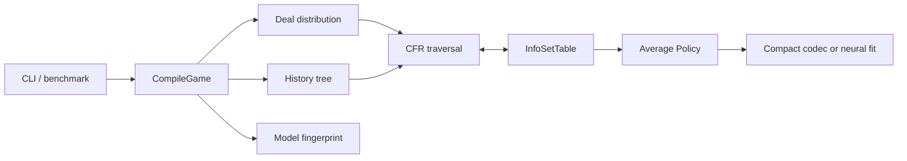
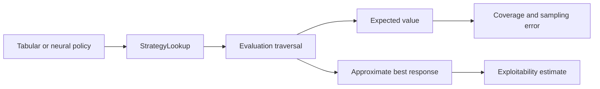
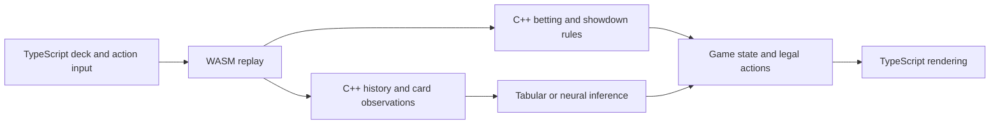

# PokerBot

PokerBot is a heads-up no-limit Hold'em research solver. It contains tabular
CFR, Deep CFR, policy evaluation and compression, and a browser demo that runs
the shared C++ abstractions through WebAssembly.

## Build and test

Bazelisk reads the pinned Bazel version from `.bazelversion`.

```sh
bazel test //tests:game_rules_test //tests:poker_test \
  //tests:card_abstraction_modes_test //web:policy_decoder_test
bazel build //src:poker_solver //tools:cfr_benchmark //tools:policy_compare
```

Neural targets currently require Apple Silicon, Xcode, and the macOS LibTorch
archive declared in `MODULE.bazel`:

```sh
bazel test //tests:neural_policy_test //tests:deep_cfr_test
```

Build and run the browser demo with:

```sh
cd web/app
npm ci
npm run dev
```

Model artifacts under `models/` are local inputs and are not tracked by Git.

## Architecture

| Area | Responsibility |
| --- | --- |
| `src/poker.*` | Cards, betting rules and transitions, deals, and showdown comparison |
| `src/bet_abstraction.*` | Converts a decision state into the ordered action set used by a model |
| `src/card_abstraction.*` | Canonicalized public and private observations used in infoset keys |
| `src/history.*` | Builds the complete abstract betting-history tree |
| `src/cfr_traversal.h` | Shared recursive CFR traversal; backends own storage only |
| `src/solver.*` | Game compilation, infoset storage, tabular CFR training, and policy extraction |
| `src/evaluation.*` | Policy-independent value and approximate best-response evaluation |
| `src/neural_features.*` | Portable neural input schema and feature encoding |
| `src/neural_policy.*` | LibTorch training, cached evaluation lookup, inference, and serialization |
| `src/deep_cfr.*` | Deep CFR memories and training schedule |
| `src/policy_codec.*` | Compact quantized tabular policy format |
| `web/policy_decoder_wasm.*` | Browser policy loading, C++ state reconstruction, and inference |

The dependency direction is intentional: poker rules and abstractions do not
depend on a solver; core evaluation does not depend on LibTorch; the browser
adapter depends on the same history, card, action, and feature code as native
training.

## Training flow



## Evaluation flow



## Browser query flow



## Compatibility contracts

- Action order is defined by `SelectAbstractActions()` and must match history
  child order, policy rows, neural outputs, and browser results.
- Model fingerprints cover the game, ranges, abstractions, and explicit schema
  versions. Loaders reject artifacts for another model.
- A `StrategyLookup` that returns `false` requests uniform fallback. Evaluation
  initializes the output; a failed lookup need not write it.
- CFR traversal owns reach and linear iteration weighting. Storage backends
  receive the final weight and must not apply it again.

For meaningful benchmark comparisons, use an optimized build, fixed flags and
seeds, multiple runs, and report the median with hardware, Git revision, peak
RSS, infoset count, and whether action sampling was enabled.
